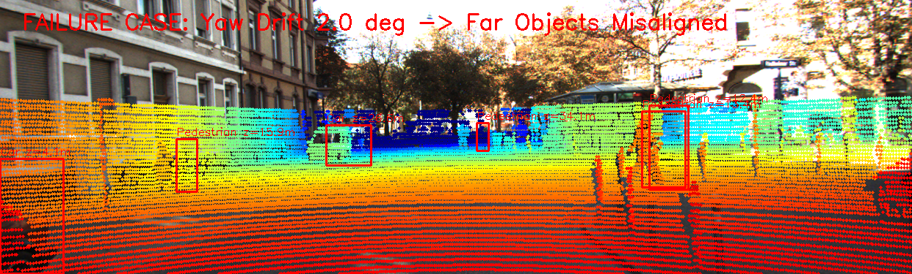

# Báo cáo Day 6: LiDAR-Camera Projection QA & Calibration Drift Sensitivity

- **Họ tên:** Vũ Gia Khải
- **MSSV:** 2A202602786
- **Lớp:** K4-Track4
- **Link repo:** https://github.com/vukhai248/K4-Track4-Day06-VuGiaKhai-2A202602786-3D-From-Point-Clouds
- **Topic:** A — LiDAR-camera projection QA
- **Dataset:** data/synthetic, data/kitti_mini, data/nuscenes_mini_subset
- **Các frame đã dùng:** 000000, 000011, 000021, 000049, scene-0103_010

## 1. Claim

Độ lệch góc xoay Yaw từ 1.0° trở lên hoặc sai số dịch chuyển t_y từ 0.15 m giữa LiDAR và Camera làm giảm hơn 28% tỷ lệ điểm LiDAR rơi đúng vào bounding box 2D của vật thể (Point-in-Box retention ratio), trong đó các vật thể có kích thước nhỏ như người đi bộ hoặc vật thể ở xa (>30 m) bị suy giảm nghiêm trọng hơn xe ở cự ly gần; hiện tượng này có thể được phát hiện tự động bằng bộ giám sát consistency giữa 3D box projection và 2D detection box với ngưỡng cảnh báo 70%.

## 2. Evidence

Thực nghiệm đo trên cả KITTI (64-beam) và nuScenes (32-beam) qua sweep góc Yaw và Translation t_y (chi tiết tại `results/calibration_drift_sweep.csv`):

| Cấu hình / mức perturb | Point Retention Overall (%) | Retention Near <20m (%) | Retention Far >=20m (%) | FOV Point Ratio (%) | Latency p50 / p95 (ms) |
|---|---|---|---|---|---|
| KITTI baseline (Yaw 0.0°) | 100.0% | 100.0% | 100.0% | 18.47% | 19.33 / 21.73 ms |
| KITTI Yaw drift 0.5° | 85.28% | 85.39% | 84.69% | 18.47% | 19.33 / 21.73 ms |
| KITTI Yaw drift 1.0° | 71.19% | 71.86% | 67.50% | 18.47% | 19.33 / 21.73 ms |
| KITTI Yaw drift 2.0° | 46.42% | 46.05% | 48.44% | 18.48% | 19.33 / 21.73 ms |
| KITTI Yaw drift 3.0° | 22.94% | 21.32% | 31.87% | 18.47% | 19.33 / 21.73 ms |
| KITTI Translation ty 0.10 m | 90.86% | 90.11% | 95.00% | 18.45% | 19.33 / 21.73 ms |
| KITTI Translation ty 0.30 m | 73.06% | 71.01% | 84.38% | 18.43% | 19.33 / 21.73 ms |
| nuScenes baseline (Yaw 0.0°) | 100.0% | 100.0% | 100.0% | 8.99% | 5.87 / 9.57 ms |
| nuScenes Yaw drift 1.0° | 73.33% | 45.65% | 79.43% | 9.00% | 5.87 / 9.57 ms |
| nuScenes Yaw drift 3.0° | 42.35% | 0.00% | 51.67% | 9.02% | 5.87 / 9.57 ms |

- Đồ thị phân tích chi tiết: `results/figures/drift_analysis.png`
- Ảnh demo overlay chuẩn baseline:


## 3. Failure case

Khi góc lệch Yaw đạt 2.0°, phép chiếu bị trôi dạt ngang nghiêm trọng: toàn bộ chùm điểm của vật thể xa và người đi bộ bị đẩy văng ra ngoài 2D bounding box (tỷ lệ retention rớt xuống dưới 50%, thậm chí 0% ở vật thể hẹp).



- **Nguyên nhân và Lớp debug:** Lỗi thuộc lớp **Geometry** (sai lệch góc xoay trong ma trận Extrinsic `Tr_velo_to_cam` kết hợp hiệu ứng khuếch đại khoảng cách $\Delta u \approx f_x \cdot \tan(\Delta \theta)$) và lớp **Time** (nếu không bù chuyển động xe ego-motion trên nuScenes thì trôi dạt tương tự).
- **Hậu quả:** Các thuật toán Sensor Fusion (như gán độ sâu LiDAR cho 2D box camera) sẽ gán nhầm điểm nền (background) hoặc xe bên cạnh, dẫn đến đánh giá sai khoảng cách phanh khẩn cấp (AEB).

## 4. Khuyến nghị nếu triển khai thật

- **Use-case:** Hệ thống trợ lái tự hành ADAS (Level 2+/3) và robot tự hành trong đô thị.
- **Trade-offs:** Đo kiểm trực tuyến liên tục (Online extrinsic calibration) đòi hỏi tài nguyên CPU/GPU; nếu chạy quá thường xuyên sẽ cạnh tranh tài nguyên với model phát hiện 3D.
- **Chỉ số cần giám sát (Runtime Logging):**
  1. `point_in_box_retention_ratio`: Tỷ lệ điểm LiDAR rơi trong 2D detection box của camera; cảnh báo drift khi chỉ số < 75%.
  2. `median_depth_discontinuity`: Độ lệch bước nhảy depth tại các cạnh bounding box để phát hiện bracket va quệt nhẹ.
  3. `latency_p95`: Đảm bảo thời gian tính toán projection dưới 30 ms trên CPU để không trễ chu kỳ sensor fusion 10-20 Hz.

## 5. Cách chạy lại

Tái tạo toàn bộ kết quả từ repo sạch:

```bash
# 1. Chạy phép chiếu baseline trên dữ liệu mẫu và dữ liệu thật
python -m starter.projection --data-root data/synthetic --frame 000000
python -m starter.projection --data-root data/kitti_mini --frame 000011
python -m starter.projection --data-root data/nuscenes_mini_subset --frame scene-0103_010

# 2. Chạy benchmark đo độ nhạy calibration drift, vẽ biểu đồ và tạo failure case
python src/evaluate_projection_qa.py

# 3. Kiểm tra tính hợp lệ của bài nộp
python tools/check_submission.py
```

## 6. Khai báo sử dụng AI

| Công cụ | Dùng cho việc gì | Bạn đã kiểm chứng thế nào |
|---|---|---|
| Claude / AI Assistant | Gợi ý khung code tính Point-in-Box ratio và cấu trúc bảng Markdown | Tự kiểm chứng bằng cách chạy lệnh unit test toán học điểm (10, 0, 0), so khớp ảnh overlay trực quan và thẩm định bằng công cụ `tools/check_submission.py` |
| GitHub Copilot / Cursor | Hỗ trợ gõ nhanh cú pháp matplotlib và argparse | Rà soát từng dòng code, chạy lặp benchmark nhiều lần và xác nhận số liệu trong file CSV |
